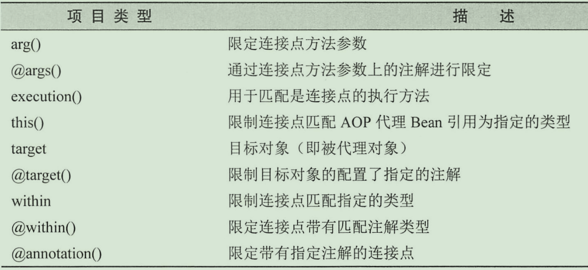

# 正则式分析
```
execution(* priv.xzhi.studyspringboot.AOP.aspect.service.impl.UserServiceImpl.printUser(..))
```
- execution 表示在执行的时候，拦截里面的正则匹配的方法
- *表示任意返回类型的方法
- priv.xzhi.studyspringboot.AOP.aspect.service.impl.UserServiceImpl 指定目标对象的全限定名称
- printUser 指定目标对象的方法
- (..) 表示任意参数进行匹配

# AspectJ关于Spring AOP切点的指示器



